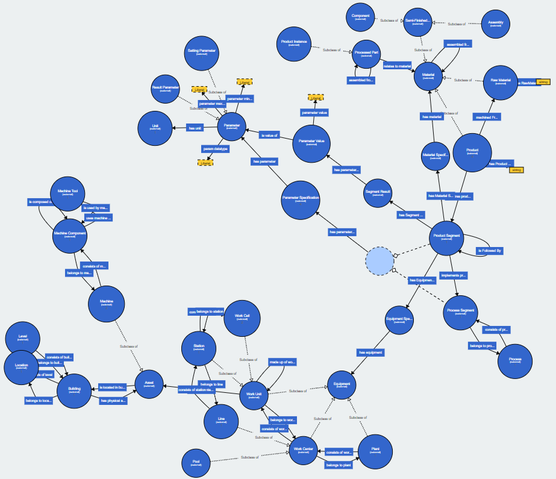

# ESMF I4.0 Core Information Model

This repository contains the implementation of the ESMF I4.0 Core Information Model as described in
the [whitepaper](OMP-SDS-Whitepaper_I4.0_Core_Information_Model.pdf) as a set of modularized
ontologies.

Note that the ESMF I4.0 Core Information Model was previously known as the _OMP I4.0 Core
Information Model_ and was developed and maintained by the Semantic Data Structuring (SDS) working
group of the Open Manufacturing Platform (OMP); this is reflected in the whitepaper linked above.
With the transition from OMP to the Eclipse Semantic Modeling Framework (ESMF), file names and
ontology namespaces have changed, however, the concepts, content and structure of the ontology
remains unchanged.

The ESMF I4.0 Core Information Model provides a common and standardized definition of relevant
manufacturing entities, their attributes, and relationships, including their semantic meaning. The
contents of the information model are based on the [IEC 62264-1
standard](https://www.iso.org/standard/57308.html). The Information model is implemented in a set of
modularized ontologies. This enables manufacturing enterprises to efficiently integrate data and
provide a clear semantic context, thus reducing the time required to generate insights from the
data. Furthermore, the ESMF I4.0 Core Information Model allows companies to reuse data-processing
applications across heterogeneous data sources as the standardized data model acts as an abstraction
layer over the heterogeneous data decoupling data sources from data processing applications.

## Ontology Visualization

### The ESMF I4.0 Core Information Model Sub-models:
- Physical Asset Ontology (`phys:`)
- Equipment Ontology (`eqm:`)
- Product Ontology (`prod:`)
- Parameter Ontology (`param:`)
- Product Segment Ontology (`prod-seg:`)
- Process Segment Ontology (`pros-seg:`)

The file esmf-i40-core.ttl imports the ontologies and defines relationships between entities of
different modularized ontologies.

## The ESMF I4.0 Core Information Model Use Cases:
- Manufacturing Traceability: The ESMF I4.0 Core Information Model provides model entities needed to
implement manufacturing traceability, starting from the product model defining a recursive model of
the assembled materials to the product segment model defining entities for the description of the
result of manufacturing processes and individual parts assembly enabling a traceability at both the
product definition and product instance level.

- Manufacturing Process Quality Monitoring: The ESMF I4.0 Core Information Model provides the means
to describe process chains, including process result parameters and their tolerances. This provides
the basis for process quality monitoring use cases.

- Asset Inventory: The ESMF I4.0 Core Information Model provides with the physical asset model a
good way to implement asset inventory use cases in which one needs to know which assets are located
in which buildings and production lines.

- Production Planning: The I4.0 Core Information model can also be used for production planning. The
process model provides a way to describe the general manufacturing processes, whereas the product
segment model provides ways to describe concrete implementations of the process segments for
concrete products.

## Contributors:
- Soufiane Ameziane (Teradata Corp.)
- Irlan Grangel-Gonzalez (Robert Bosch GmbH)
- Piotr Janik (Intel Corp.)
- Marcel Keller (Robert Bosch GmbH)
- Felix Loesch (Robert Bosch GmbH) – Coordinator of ESMF I4.0 Core Information Model
- Fabio Massari (VMware Inc.)
- Denis Molin (Teradata Corp.)
- Nico Wilhelm (ZF Friedrichshafen AG)
